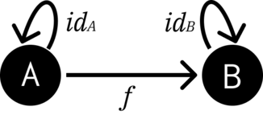

=========================================
1 :: Category: The Essence of Computation
=========================================

Notes
=====

Categories consist of **objects** and **morphisms** between those objects.
Morphisms between objects can be composed:

Implies the composition of :math:`g \circ f`:

If we think of objects as types and morphisms as functions between those
types:

.. code-block:: haskell

    f :: A -> B
    g :: B -> C

Then composition would be feeding the result of evaluating ``f`` into ``g``. In
Python, it would look something like ``g(f(x))``. In Haskell, one can use ``g . f``.

Composition of morphisms should be associative, meaning that:

.. math::

    h \circ (g \circ f) = (h \circ g) \circ f = h \circ g \circ f

Objects also have an identity morphism:

The identity morphism implies that :math:`f \circ id_{A} = f` and
:math:`id_{B} \circ f = f`.

1.4 :: Challenges
=================

1.4.1
.....

**Implement the identity function in your favourite language (that isn't Haskell).**

.. code-block:: python

    def id(a):
        return a

1.4.2
.....

**Implement the composition function in your favourite language (takes 2 functions
as arguments and returns their composition).**

.. code-block:: python

    def compose(f, g):
        return lambda x: g(f(x))

1.4.3
.....

**Write a program that tests your composition function respects identity.**

.. code-block:: python

    f = lambda x: x * x
    assert compose(f, id)(9) == f(9)
    assert compose(id, f)(9) == f(9)

1.4.4
.....

**Is the world wide web a category in any sense? Are links morphisms?**

Yes. If there is a link from page A to page B, and a link from page B to page C,
then the morphisms are composable as there is a hyperlink chain from A to C.

1.4.5
.....

**Is Facebook a category, with people as objects and friendships as morphisms**

I don't think so. Person A and Person B being friends, and Person B and Person C
being friends does not imply that Person A and Person C are friends. Friendships
are not composable, so Facebook is not a category.

1.4.6
.....

**When is a directed graph a category?**

When, assuming the nodes are objects and edges are morphisms, every node has
an edge that resolves at itself (the identity morphism). An edge from node A
to node B (A -> B), and an edge from node B to node C (B -> C), implies a traversable
path of A -> B -> C, which is essentially a composed morphism of A -> C. I think.
