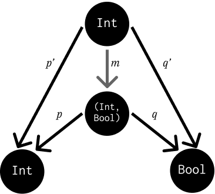
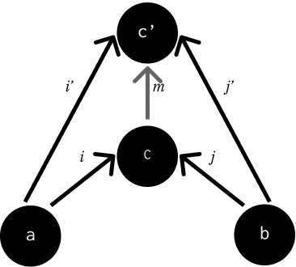

=======================
Products and Coproducts
=======================

Notes
=====

An **initial object** in a category is an object that has 1 and only 1 morphism
going to any object in the category. Object a is more initial than b if
:math:`a \rightarrow b`.

In the category of sets, this is the ``Void`` Haskell type with ``absurd :: Void -> a``
as the universally polymorphic morphism.

A **terminal object** a category is an object that has 1 and only 1 morphism
going to it from any object in the category. Object a is more terminal than b
if :math:`a \leftarrow b`.

In the category of sets, this is a singleton set: ``()`` in Haskell, with
``unit :: a -> ()`` as the morphism.

For any category :math:`C`, we can define the opposite category :math:`C^{op}`
by reversing the morphisms. If :math:`f :: a \rightarrow b`, :math:`g :: b \rightarrow c`
with their composition :math:`g \circ f = h :: a \rightarrow c`, then we can
define :math:`f^{op} :: a \leftarrow b`, :math:`g^{op} :: b \leftarrow c` and
:math:`h^{op} :: a \leftarrow c`. The terminal object in :math:`C` is the initial
:math:`C^{op}`, and vice versa.

An **isomorphism** is a pair of morphisms such that :math:`f \circ g = id` and
:math:`g \circ f = id`.

Initial objects are unique up to unique isomorphisms. Take 2 initial objects,
:math:`i_1` and :math:`i_2`, with morphisms :math:`f :: i_1 \rightarrow i_2` and
:math:`g :: i_2 \rightarrow i_1`. :math:`g \circ f` is a morphism from
:math:`i_1 \rightarrow i_1`.
Since :math:`i_1` is initial, there can be only 1 morphism from it, so
:math:`g \circ f = id_{i_1}`. Similarly, :math:`f \circ g = id_{i_2}`. :math:`f`
and :math:`g` must be the inverse of each other. Therefore, **any 2 initial
objects are isomorphic**.

Products
--------

A product of two objects :math:`a` and :math:`b` is the object :math:`c` equipped
with two **projections** (:math:`p :: c \rightarrow a` and :math:`q :: c \rightarrow b`)
such that for any other object :math:`c'` equipped with two projections there is
a *unique morphism* :math:`m :: c' \rightarrow c` that factorizes those projections.

For example, consider the product between the types ``Int`` and ``Bool``. There
could be two candidates for the product of those two types, ``Int`` and ``(Int, Bool)``:

In this case, :math:`p'` and :math:`q'` could be constructed in terms of
:math:`m`:

.. code-block:: haskell

   m :: Int -> (Int, Bool)
   m x = (x, True)

   p :: (Int, Bool) -> Int
   p (x, _) = x

   q :: (Int, Bool) -> Bool
   q (_, x) = x

   p' :: Int -> Int
   p' x = p (m x)     -- this would equal x

   q' :: Int -> Bool
   q' x = q (m x)     -- this would equal True

Coproducts
----------

A **coproduct** of two object :math:`a` and :math:`b` is the object :math:`c`
equipped with two **injections** (:math:`i :: a \rightarrow c` and
:math:`j :: b \rightarrow c`) such that for any other object :math:`c'` equipped
with two injections there is a *unique morphism* :math:`m :: c \rightarrow c'`
that factorizes those injections:

In the category of sets, the coproduct is the *disjoint union* of two sets.
In programming, a coproduct can be a tagged union of 2 types - cannonically
``Either`` in Haskell:

.. code-block:: haskell

   data Either a b = Left a | Right b

Asymmetries
-----------

The terminal object can be obtained from reversing the morphism directions
of an initial object. A coproduct can be obtained from reversing the morphisms
of a product. However, asymmetries exist in the category of sets. Take a
function from a singleton set:

.. code-block:: haskell

   f100 :: () -> Integer
   f100 () = 100

Functions are *total*, in that they are defined for every element of the
domain set. However, functions don't have to cover the whole codomain. ``f100``
is a total function in that is covers every value of ``()``, but only covers one
value of the codomain: ``100`` in the set of integers. Functions that have a
smaller domain than the codomain *embed* the domain in the codomain. Functions
that tightly fill their codomains are **surjective** or **onto**.

Functions can also map many elements of the domain onto one element of the
codomain:

.. code-block:: haskell

   intToTrue:: Integer -> Bool
   intToTrue _ = True

In this sense, they *collapse* the domain into the codomain. Functions that
do not do this are **injective** or **one-to-one**.

Some functions are *both surjective and injective*. They are **bijections**,
and are properly invertable. An ismorphism in the category of sets is a bijection.

Challenges
==========

