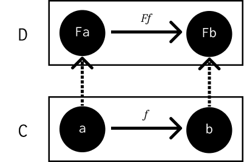

========
Functors
========

Notes
=====

A functor is a mapping between categories. Give an category :math:`C` with an
object :math:`a` and a category :math:`D`, the functor :math:`F` will map the
object :math:`a` to :math:`Fa` in category :math:`D`.

This mapping applies to morphisms too:

.. math::

   f :: a \rightarrow b

   Ff :: Fa \rightarrow Fb

A functor, therefore, looks like:

A functor **preserves the structure of a category**. This also applies to
composition:

.. math::

   h = f \circ g

   Fh = Ff \circ Fg

As well as identity morphisms:

.. math::

   Fid_a = id_{Fa}

A functor from a singleton category to any other just selects a single object
in that category. The constant functor :math:`{\Delta}_c` maps every object in
the source category to 1 selected object :math:`c` in the target. It also maps
every morphism in the source category to the identity morphism :math:`id_c`.

An **endofunctor** is a functor that maps a category to itself, such as types
to types.

Functions between categories compose, just as morphisms between objects
compose. Functor composition is associative, and every category has a trivial
identity functor that maps every object and morphism it itself.

Functors have the same properties as morphisms in the category of categories.
The category of categories, like the set of all sets, would have to contain
itself and thus be paradoxical. However, there is a category of *small
categories* called **Cat**. Cat is big, so it cannot be a member of itself.
A small category is one whose objects form a set and nothing larger than a
set, even if that set is uncountably infinite.
