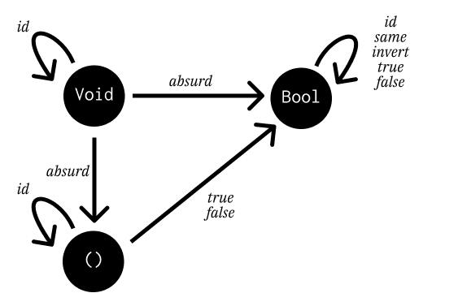

===================
Types and Functions
===================

Notes
=====

Types can be thought of as sets of values. Types can be finite, in the case
of ``Bool`` (``True`` or ``False``). They can also be infinite sets, such as
``String``. A type declaration like ``x :: Integer`` declares that ``x`` is
a member of the set of integers.

**Set** is the category of sets. Objects in this category are sets, and
morphisms are mathematical functions between members of those sets.

Ideally, we'd like to think of Haskell types as sets and Haskell functions as
mathematical ones. However, mathematical functions are *not executed*, whereas
Haskell ones are. This isn't a problem if a Haskell function terminates, but
many Haskell functions may not.

Distinguishing between functions that terminate and those that do not isn't
possible (and is the basis of the Halting Problem). So, types are extended by
an extra value to correspond to a non-terminating computation - the **bottom**
( :math:`\bot` ). So ``Bool`` can return values of ``True``, ``False`` or :math:`\bot`.

Functions that return bottom are **partial functions**. Functions that
terminate for every possible argument are **total functions**. Because the set
of values for types have to be extended to include :math:`\bot`, the category
of Haskell types/functions is actually called **Hask**.

Since types are sets, we can correspond between different sets and their Haskell
types. The empty set in Haskell is known as ``Void``, functions that take ``Void``
as their argument can never be called, as there is no value that can be given:

.. code-block:: haskell

    absurd :: Void -> a

``absurd`` is universally polymorphic in its return type, as it can never be
evaluated. ``Void`` represents falsity.

Singleton sets are types that have only 1 possible value. In Haskell, this is
``()`` or **unit**. A function that takes unit essentially picks a single element
from it's target type:

.. code-block:: haskell

    f100 :: () -> Integer
    f100 () = 100

A function that returns unit does nothing and discards its argument, essentially
mapping every member of the input type to the singleton element:

.. code-block:: haskell

   unit :: a -> ()
   unit _ = ()

Functions from ``Bool`` pick 2 elements from the target type. Functions to
``Bool`` are called **predicates**.

Challenges
==========

2.1
---

**Define a higher-order function** ``memoize`` **in your favourite language.
It takes a pure function** ``f`` **and return a function that behaves exactly
like** ``f`` **, except that it only calls the original function once for
every argument, stores the results internally and subsequently returns the
stored result every time it's called with the same argument.**

.. code-block:: python

    def memoize(f):
        memoizations = {}

        def memoized_f(*args):
            if x not in memoizations:
                memoizations[args] = f(*args)
            return memoizations[args]
        return memoized_f

2.2
---

**Try to memoize a function from your standard library that you normally use
to generate random numbers. Does it work?**

No. ``random.random`` produces different results for the same input (as it takes
no arguments):

.. code-block:: python

    >>> from random import random
    >>> random()
    0.28923775328303525
    >>> random()
    0.6137792703358512

The function has *side-causes*, in which the value it returns is not dependant
on its argument. Memoization this function would produce produce a function
that always returns the same value after the first time it's computed.

2.3
---

**Most random number generators can be initialized with a seed. Implement
a function that takes a seed, calls the random number generator with that
seed and returns the result. Memoize that function. Does it work?**

.. code-block:: python

    def seeded_random(seed):
        random.seed(seed)
        return random.random()

The memoized version of this function works as expected:

.. code-block:: python

    >>> mseeded = memoize(seeded_random)
    >>> seeded_random(10) == mseeded(10)
    True
    >>> mseeded(10) != mseeded(20)
    True

2.5
---

**How many functions are there from** ``Bool -> Bool``. **Can you implement
them all?**

.. code-block:: haskell

    same :: Bool -> Bool
    same = id

    invert :: Bool -> Bool
    invert = not

    true :: Bool -> Bool
    true _ = True

    false :: Bool -> Bool
    false _ = False

2.6
---

**Draw a picture of a category whose only objects are the types** ``Void``, ``()``
**and** ``Bool`` **; with arrows corresponding to all possible functions between these
types.**

