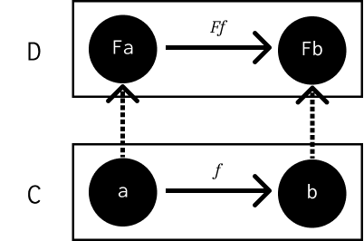

========
Functors
========

Notes
=====

A functor is a mapping between categories. Give an category :math:`C` with an
object :math:`a` and a category :math:`D`, the functor :math:`F` will map the
object :math:`a` to :math:`Fa` in category :math:`D`.

This mapping applies to morphisms too:

.. math::

   f :: a \rightarrow b

   Ff :: Fa \rightarrow Fb

A functor, therefore, looks like:

A functor **preserves the structure of a category**. This also applies to
composition:

.. math::

   h = f \circ g

   Fh = Ff \circ Fg

As well as identity morphisms:

.. math::

   Fid_a = id_{Fa}

A functor from a singleton category to any other just selects a single object
in that category. The constant functor :math:`{\Delta}_c` maps every object in
the source category to 1 selected object :math:`c` in the target. It also maps
every morphism in the source category to the identity morphism :math:`id_c`.

An **endofunctor** is a functor that maps a category to itself, such as types
to types.

Functions between categories compose, just as morphisms between objects
compose. Functor composition is associative, and every category has a trivial
identity functor that maps every object and morphism it itself.

Functors have the same properties as morphisms in the category of categories.
The category of categories, like the set of all sets, would have to contain
itself and thus be paradoxical. However, there is a category of *small
categories* called **Cat**. Cat is big, so it cannot be a member of itself.
A small category is one whose objects form a set and nothing larger than a
set, even if that set is uncountably infinite.

Challenges
==========

7.1
---

**Can we turn the Maybe type constructor into a functor by defining:**

.. code-block:: haskell

   fmap _ _ = Nothing

**which ignores both of its arguments?**

First, lets prove the preservation of identity with the first case, ``Nothing``:

.. code-block:: haskell

     fmap id Nothing
   = { definition of fmap }
     Nothing
   = { definition of id }
     id Nothing

So the preservation of identity with ``Nothing`` holds. However, when we
consider the second case:

.. code-block:: haskell

     fmap id (Just x)
   = { definition of fmap }
     Nothing
   = { definition of id }
     id Nothing

If the preservation of identity held, then we would expect the last substitution
to be ``id (Just x)``. This means we cannot turn ``Maybe`` into a functor with
that definition of ``fmap``.

7.2
---

**Prove functor laws for the reader functor.**

The reader functor is defined as:

.. code-block:: haskell

   instance Functor ((->) r) where
      fmap f g = f . g

For clarity's sake, the type signature for this application of fmap would
be ``fmap :: (a -> b) -> (r -> a) -> (r -> b)``. First, lets prove the
identity law:

.. code-block:: haskell

     fmap id g
   = { definition of fmap }
     id . g
   = { definition of id }
     g
   = { definition of id }
     id g

Next, the composition preservation law ``fmap (g . f) = fmap g . fmap f``:

.. code-block:: haskell

     fmap (g . f) h
   = { definition of fmap (with some associativity sprinkled in }
      g . f . h
   = { definition of fmap }
     g . (fmap f h)
   = { definition of fmap }
     fmap g (fmap f h)
   = { definition of composition }
     (fmap g . fmap f) h

7.3
---

**Implement the reader functor in your favourite, non-Haskell language.**

.. code-block:: python

   from functools import partial
   from typing import Generic, TypeVar, Callable, Any

   r, a, b = TypeVar("r"), TypeVar("a"), TypeVar("b")

   class Reader:
       @staticmethod
       def fmap(f: Callable[[a], b], g: Callable[[r], a]) -> Callable[[r], b]:
           return lambda x: f(g(x))

   def id(x: Any) -> Any:
       return x

   def a2b(x: int) -> str:
       return " ".join(["Hello!"] * x)

   def r2a(x: int) -> int:
       return x * 2

   assert Reader.fmap(id, r2a)(2) == r2a(2)
   assert Reader.fmap(a2b, r2a)(2) == "Hello! Hello! Hello! Hello!"

(I think.)
