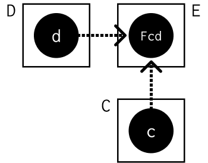
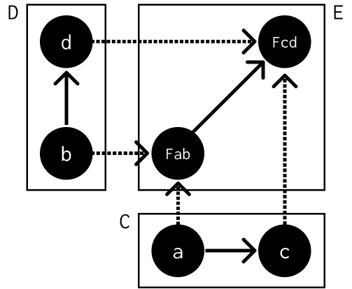
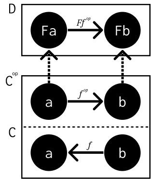
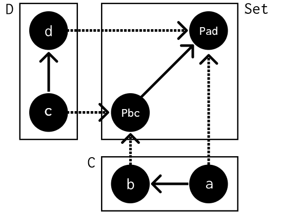

=============
Functoriality
=============

Notes
=====

A **bifunctor** is a functor of two arguments that maps every pair of objects,
one from :math:`C` and one from :math:`D`, to an object in `E`.

This is just a mapping of a cartesian product :math:`C \times D \rightarrow E`.

However, bifunctors must map morphisms too. Morphisms in a cartesian product
of categories are pairs of morphisms, :math:`(f, g)`. We can compose these
pairs:

.. math::

   (f, g) \circ (f', g') = (f \circ f', g \circ g')

This composition is also associative and has an identity :math:`(id, id)`.
Categories where join functorality fails are *premonoidal*.

Products and coproducts, if they're defined for every pair of objects in a
category, are bifunctors. In Haskell, pairs ``(a, b)`` and ``Either a b`` are
both instances of ``Bifunctor``.

One of the requirements for a monoidal category is that the binary operator
associated with it is a bifunctor.

Sum and product types are functorial, as bifunctors. The basic building blocks
of algebraic data types are too: the ``Const ()`` functor (like ``Nothing`` in
``Maybe``) and the ``Identity`` functor (like ``Just a`` in ``Maybe``).
Everything else in algebraic data structures is composed from those 2 primitives
using products and sums.

With this in mind, we can define the ``Maybe`` up to isomorphism as a composition
of the bifunctor ``Either`` with the 2 functors ``Const ()`` and ``Identity``:

.. code-block::

   data Maybe a = Either (Const () a) (Identity a)

Consider 3 categories: :math:`C`, :math:`C^{op}` and :math:`D`, with a functor
between :math:`C^{op}` and :math:`D`:

.. math::

   F :: C^{op} \rightarrow D

This functor maps :math:`f^{op} :: a \rightarrow b` in :math:`C` to
:math:`Ff^{op} :: Fa \rightarrow Fb` in D.

Alongside this, we can define a mapping :math:`G`, which is not a functor,
from :math:`C` to :math:`D`. It maps objects, but reverses the morphisms it
maps. It takes :math:`f :: b \rightarrow a` in :math:`C`, maps it to its
opposite in :math:`C^{op} f^{op} :: a \rightarrow b`, and then uses the functor
:math:`F` to get :math:`Ff^{op} :: Fa \rightarrow Fb`.

Since :math:`Fa` and :math:`Ga` are the same, this can be described as:

.. math::

   Gf :: (b \rightarrow a) \rightarrow (Ga \rightarrow Gb)

A mapping of categories that *inverts* the morphism direction like this is a
**contravariant functor**.

Regular functors are **covariant functors**. A contravariant functor is a
covariant functor from the opposite category.

``(->)`` is contravariant in its first argument and covariant in the second.
If the target category is **Set**, this is a **profunctor**. Contravariant
functors are equivalent to covariant functors in the opposite set, so a
profunctor is defined as:

.. math::

      C^{op} \times D \rightarrow Set

And looks like:

The mapping that takes a pair of objects :math:`(a, b)` and assigns the pair
to the set of morphisms between them, :math:`Hom_{C}(a, b)`, is a functor from
:math:`C^{op} \times C \rightarrow Set`.
